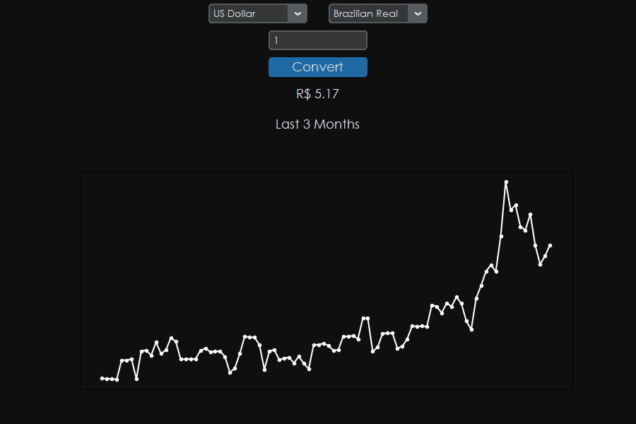

# Currency Converter

This project consists of a currency converter desktop application featuring a user-friendly and intuitive GUI with over 160 currencies, and a graphic displaying the values of that conversion for the last 3 months.

## Tools and Modules

- This project uses the **API** from [Currency Beacon](https://currencybeacon.com/) to get the conversions and daily values for that period of time.
- The **Requests** module is used to retrieve the necessary information from the API.
- The **CustomTKinter** module is used to create the intuitive GUI.
- The **Matplotlib** module is used to create the interactive graphic for each currency conversion.
- The **Dateutil** and **Datetime** modules are used to accurately calculate the date three months prior to today.

## How it works

When you run the program, you will have two ComboBoxes to choose the "from" and "to" currencies. Additionally, there's an entry field where you can input the value you want to convert. When you click the convert button, the information from these three inputs is used to make a request to the `/convert` endpoint, and the result is displayed below the entry field. Moreover, a request with the same currencies information is made to the `/timeseries` endpoint over a 3-month period. The values obtained from this request are used to create a plot figure showing all the values for this period. When you hover the mouse over the figure, the hover event is triggered, and the dates along with their respective values are displayed in an annotation.



## How to use

To use this project, you will need to follow these steps:

1. Clone this repository using the following command:

```
    git clone https://github.com/luisgstv/currency-converter.git
```

2. Obtain an API key in the [Currency Beacon](https://currencybeacon.com/) website and assign it to the `API_KEY` variable. In my case, I created a **key.py** file and placed it there, and you can do the same.

3. Install the required modules using the following command:

```
    pip install -r requirements.txt
```
